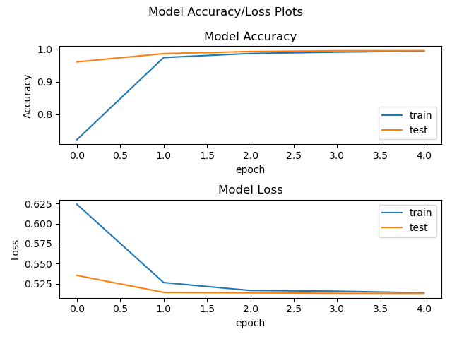

## Setup
```bash
# Creating Conda environment
conda env create -f env.yml
# Activating the environment
conda activate BioPageClassifier

# Downloading NLTK Corpora
python -m nltk.downloader all
# Downloading spaCY model
python -m spacy download en_core_web_sm
# Downloading Word Embeddings Glove.6B
[ ! -d "glove.6B" ] && \
  wget http://nlp.stanford.edu/data/glove.6B.zip && \
  mkdir -p .glove.6B && \
  unzip glove.6B.zip -d .glove.6B && \
  rm glove.6B.zip
```

## Crawler
You can run crawler to collect negative data by running the following:
```bash
# Running Spider

$ scrapy runspider crawler.py \
  -a start_url=https://www.cnn.com/ \
  -a allowed_domain=cnn.com \
  -a db=/tmp/cnn_db.json \
  -a output=/tmp \
  -a exclude='.+?(show|business).+?'
```

## Classifier
Classifier model is saved in `bio-model`
### Accuracy / Loss Chart

### Model Architecture Chart


## Usage
Get the model
```bash
wget https://drive.google.com/file/d/1NShUBtE248LN_L1zzyGbK__4I60bkk0R/view?usp=sharing
[ ! -d "bio-model" ] && unzip bio-model.zip 
```

Load the model
```python
from utils import *

bio_identifier = BioIdentifier(model="bio-model")
# Returns False
bio_identifier.is_bio_url("https://www.cnn.com/")
# Returns True
bio_identifier.is_bio_url("https://sites.google.com/a/oakland.edu/scottcrabill/Home")
...
bio_identifier.is_bio_html_content("<html>....</html>")
```
